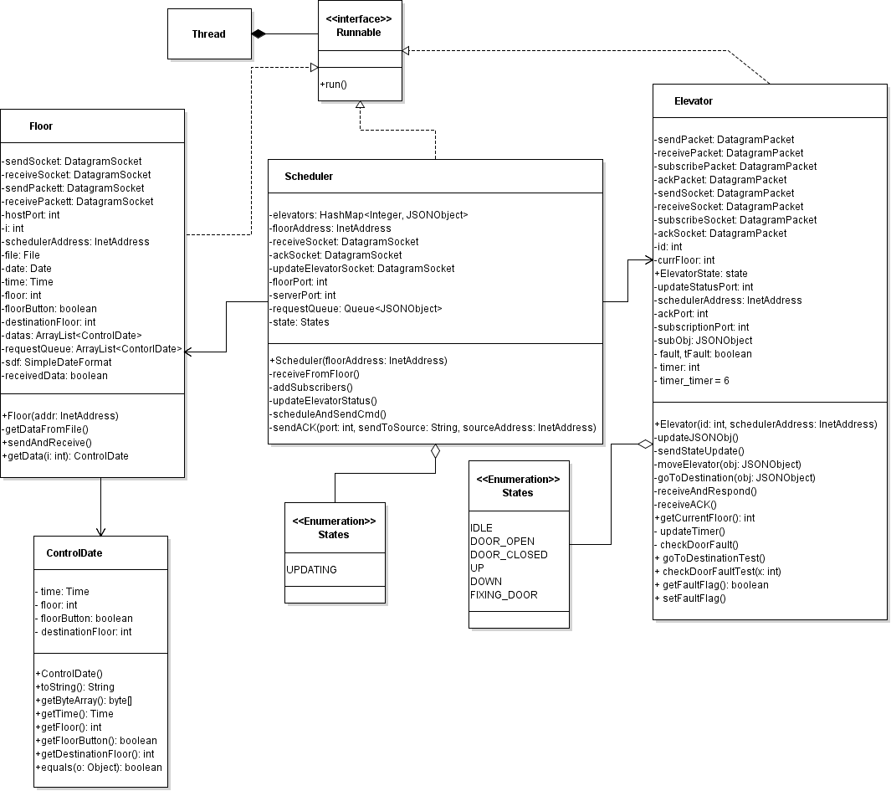
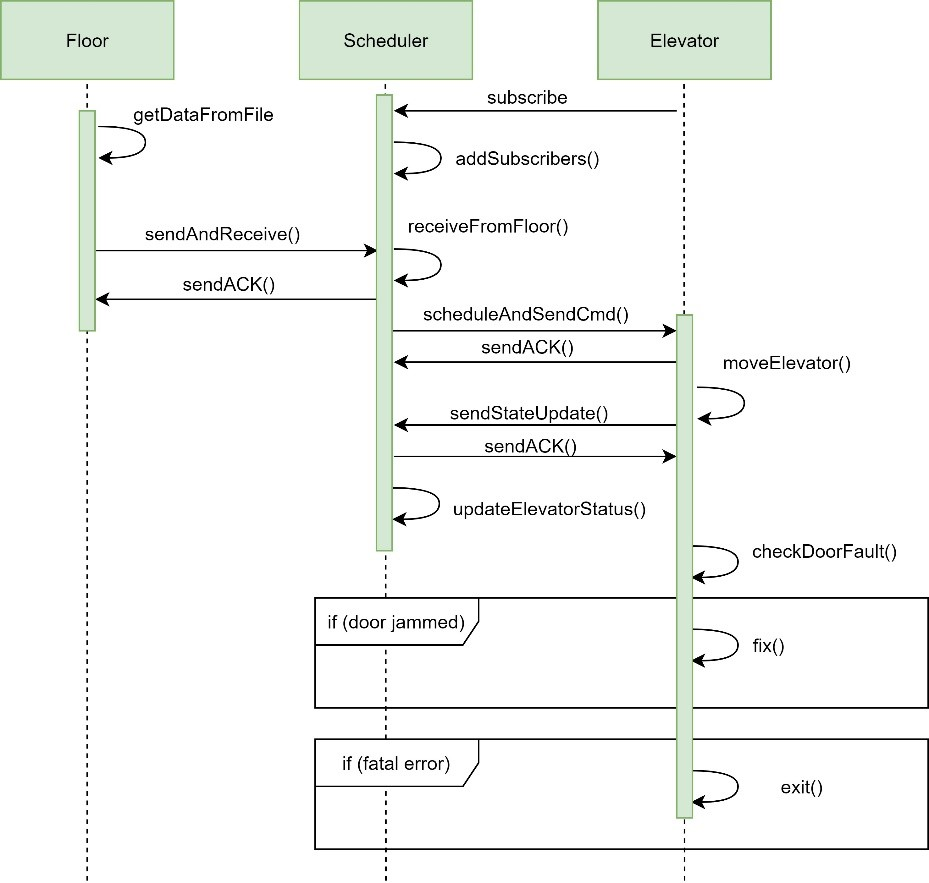
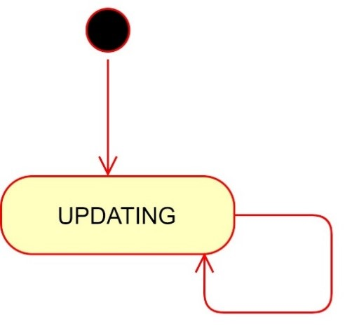
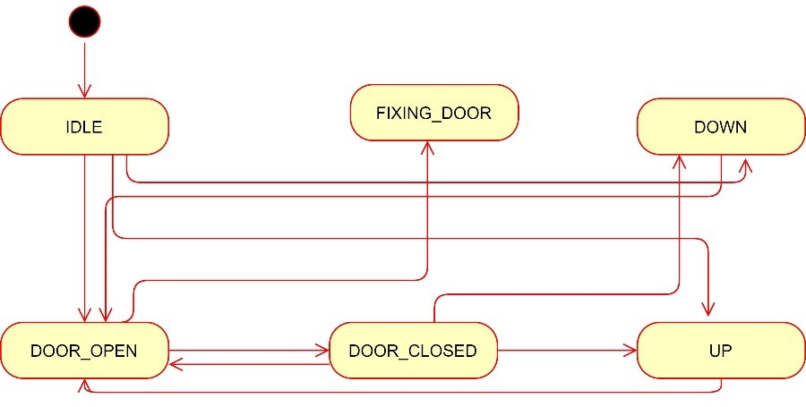

# Elevator Control System and Simulator

#### Final Submission

Purpose of Project: design and implement an elevator control system and simulator

This submission contains the fault handling in the elevator. 

Authors: Defa Hu, Zewen Chen, Henry Wilson, Mariam Almalki, Ruqaya Almalki

#### Contents of this ReadMe
- Iteration Description
- Breakdown of Responsibilities
- Explanation of Files and File Names
- Set-up Instructions
- Test Instructions 
- UML Class Diagram
- UML Sequence Diagram
- State Machine Diagrams

DESCRIPTION: 
  
          This project is simulating the elevator control system.
          we will have a file acting the user role to request the elevator.
          the Floor will get the request and send it to Scheduler. The Scheduler will decided which elevator to forward the request to.
          The Elevators will keep getting request from the Scheduler, and move to the correct floors.

### Breakdown of Responsibilities
**Zewen Chen**: Test Cases  
**Defa Hu**: Timer Logic  
**Henry Wilson**: Error integration  
**Ruqaya Almalki**: Elevator handling of faults, error integration, timer logic  
**Mariam Almalki**: Elevator handling of faults, error integration, timer logic  

### Explanation of File Names
- **Floor**: reads info from a file, sends the requests to the Scheduler, waits for an ACK before sending another packet
- **FloorTest**: JUnit test for the above class.
- **Elevator**: Subscribes to a Scheduler. Receives requests from the Scheduler. Informs Scheduler of current postion/state.
- **ElevatorTest**: JUnit test for the above class
- **Scheduler**: Receives requests from Floor. Processes the request, deciding which elevator to send the request to. Stores info of all the request and subscribed elevators 
- **SchedulerTest**: JUnit test for the above class.

### Set-up Instructions
Run the Scheduler class, the Elevator class(es) , and then the Floor class.
Note: 
1.	this project uses JSON, you may need to import the jar into the build path. To do this right-click on the project name -> Build Path -> Configure Build Path -> Add External Jar, then select the "java-json" jar file in the project file. 
2.	When running on different machines, the ip addresses fed into the scheduler, the floor, and the elevator need to be changed in order to reflect the ip addresses of the machines used.
3. Run files in the following order: scheduler, elevator(s), and floor

### Test Instructions 
Test cases are standard JUnit 5 Tests. Be sure to run each test individually to ensure that an address binding exception does not occur. 

### UML Class Diagram
This can also be found as a png file in the project zip file.  

### UML Sequence Diagram
This can also be found as a png file in the project zip file.  
 

### State Machine Diagrams
These can also be found as a png file in the project zip file.  
Scheduler State Machine Diagram:  
 
 
Elevator State Machine Diagram:  

